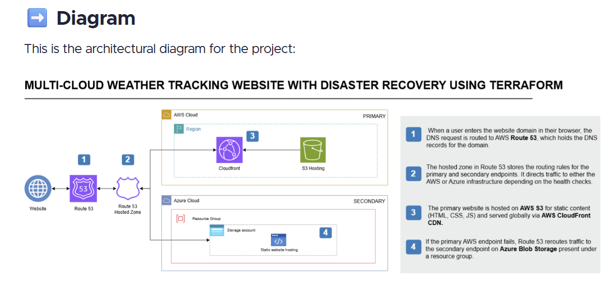
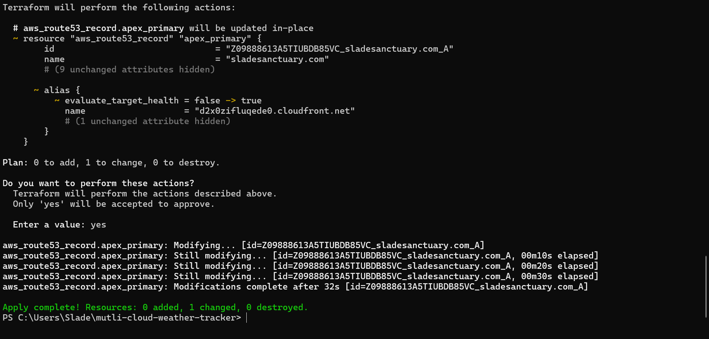

````markdown
# 🌦 Multi-Cloud Weather Tracker (Terraform • AWS + Azure)

In this project, I learned to deploy a **multi-cloud static website** with **AWS (S3 + CloudFront + Route 53)** and **Azure (Storage Static Website)**, all provisioned via **Terraform**. The goal was to understand how **DNS, CDN, HTTPS, and failover** fit together end-to-end.

> **Acknowledgment:** Architecture inspired by Lucy Wang (TechWithLucy). I implemented and debugged it myself to internalize the “why” behind each component.

---

## 🧭 Architecture Overview

Here is a diagram of the architecture, showing the user request path from Route 53, through CloudFront, to the S3 origin.



* **AWS S3** — host static site (HTML/CSS/JS/assets)  
* **CloudFront** — CDN + HTTPS in front of S3  
* **Route 53** — DNS (apex alias → CloudFront, `www` CNAME → CloudFront)  
* **Azure Storage Static Website** — DR/failover endpoint  
* **Terraform** — single source of truth for provisioning

---

## ⚙️ Terraform: How I Provisioned Everything

I kept infra in one `main.tf` and deployed with the standard flow.



```bash
terraform init
terraform validate
terraform plan
terraform apply
````

**Terraform created the S3 bucket, website config, file uploads, CloudFront, Route 53 records, Azure storage + static site, and blob uploads.**

-----

## ☁️ AWS: S3 + CloudFront

### S3 Static Website

Configured with `aws_s3_bucket_website_configuration` (new style). I uploaded `index.html`, `styles.css`, `script.js`, and all assets/ with proper MIME types.

### CloudFront in Front of S3

CloudFront provides HTTPS at the edge and global caching.

Key fix I learned: **S3 website endpoints are HTTP-only.**

If CloudFront tries HTTPS → S3 website endpoint, you’ll see **504 Gateway Timeout**.
**Solution:** set the origin to the S3 website endpoint and **Origin Protocol Policy = HTTP Only**.
*(Viewers still get HTTPS from CloudFront.)*

-----

## 🧭 AWS: Route 53 (DNS)

  * **A (Alias)** at the apex (`sladesanctuary.com`) points to CloudFront.
  * **CNAME** (`www.sladesanctuary.com`) points to CloudFront.

I updated my registrar nameservers (Bluehost) to the Route 53 NS so these records actually control the domain.

What finally clicked — **Alias vs CNAME**:

  * A **CNAME** cannot live at the **apex (root)** of a zone. That’s DNS spec.
  * AWS provides **Alias A records** that behave like CNAMEs but are valid at the apex and resolve to AWS targets (CloudFront, etc.).
  * So: `@` → **Alias A** to CloudFront; `www` → **CNAME** to CloudFront.

-----

## 🔵 Azure: Storage Static Website (DR)

I created a Storage Account (`StorageV2`, `LRS`), enabled Static Website (special `$web` container), and uploaded the same site files via Terraform.

The public endpoint looks like:
`https://<storage-account>.z13.web.core.windows.net/`

Small lesson: Azure “static website” is just the `$web` container exposed via a web endpoint—simple and effective for DR.

-----

## ✅ Final Result

**`https://sladesanctuary.com` serves the site via CloudFront (S3 origin).**
The Azure endpoint is available as a backup.
I verified with `curl` and a browser (padlock for HTTPS at the edge).

-----

## 🧠 Things I Struggled With (and fixed)

| Struggle | Cause | Fix |
| :--- | :--- | :--- |
| **Alias vs CNAME at the apex** | I tried a CNAME at the root and it failed. | Use **Alias A** at the apex → CloudFront; use **CNAME** on subdomains like `www`. |
| **CloudFront 504s to S3** | I expected HTTPS to the S3 website endpoint. It only speaks HTTP. | **Origin Protocol Policy = HTTP Only**; viewers still get HTTPS from CloudFront. |
| **DNS didn’t change after I added records** | My registrar (Bluehost) still pointed to their nameservers. | Update registrar nameservers to the **Route 53 NS** from my hosted zone. |
| **S3 403 AccessDenied** | Public site needs correct public access settings or CloudFront origin access policies. | Loosen public access for a simple static website (or use OAC for a private origin). |

-----

## 📁 Repo Structure

```
multi-cloud-weather-tracker/
├── main.tf
├── website/
│   ├── index.html
│   ├── styles.css
│   ├── script.js
│   └── assets/...
└── screenshots/
    ├── project-diagram.png
    ├── terraform-apply.png
    ├── cloudfront-distribution.png
    ├── route53-records.png
    ├── azure-static-website.png
    ├── website-live-1.png
    └── website-live-2.png
```

-----

## 🧪 Quick Verification Commands

```bash
# CloudFront (redirects HTTP → HTTPS, then OK)
curl -I http://<your-cloudfront-id>.cloudfront.net
curl -I https://<your-cloudfront-id>.cloudfront.net

# Domain resolution (PowerShell)
Resolve-DnsName sladesanctuary.com
Resolve-DnsName [www.sladesanctuary.com](https://www.sladesanctuary.com)

# Hit the site
curl -I [https://sladesanctuary.com](https://sladesanctuary.com)
```

*(Local project path: `C:\Users\Slade\multi-cloud-weather-tracker`)*
